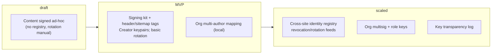
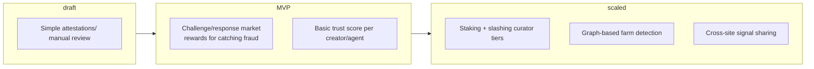
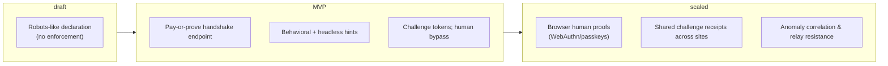
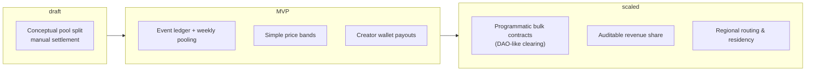

# The Human Content Compensation Protocol

This repository contains a proposal for the **Human Content Compensation Protocol (HCCP)**, a new open protocol designed to address a fundamental challenge of the modern internet: how to fairly compensate human creators for the value their work provides to Artificial Intelligence systems, especially in a world where agentic-AI systems are able to query search engines and load content dynamically to answer user questions.

As AI agents and Large Language Models (LLMs) consume vast amounts of online content for training and data analysis, the creators of that content are seldom compensated. HCCP proposes a new way forward by combining a legal framework with a decentralised technical system to create a new, equitable economic layer for the internet.

We are NOT anti-AI doomers, in fact, quite the opposite. We believe that AI has an incredible potential to advance humanity, what we are against is all reward only being in the hands of a few.

The core principle is simple: **human access to content remains free, while AI systems should pay**.

### Free content for humans?

Content creators already have a range of options for monetising their content, this proposal has no intention of changing any of this. 

The AAEL is intended to be a purely additive licence, it doesn't grant any additional rights or allowances, it acts as a "wrapper" licence on top of content creator's already existing licencing. 

The HCCP is not intended to be, nor should it ever be, a system for monetising content when it is consumed by humans.

# The Proposal

The proposal is detailed across several key documents that outline the philosophy, legal framework, and governance of the system.

*   The **[Project Overview](overview.md)** provides an introduction to the protocol, its core components, and the economic and legal background that makes this system necessary.

*   The **[Agentic AI Exclusion Licence (AAEL)](aael-v0_1.md)** is the legal licence of the protocol. It is a new licence that grants broad permissions for human use whilst explicitly requiring payment for any use by an AI system.

*   The **[Foundation for the Fair Payment of Media (FYPM)](foundation.md)** document outlines the principles and governance structure for the non-profit entity that will act as a neutral steward for the protocol.

*   The **[Economic Principles](economics.md)** document explains the financial model of the protocol, including dynamic micropayments, pooled settlement, and the future vision for DAO-governed bulk access agreements.

# Technical Specification

The technical implementation of the protocol is described in a series of interconnected Request for Comments (RFC) documents. These are early-stage drafts that outline the core systems, these documents are not technical in nature, but explain the core concepts of the systems and also outline a roadmap for how these systems may evolve over time.

*   **[RFC-HCCP-001: Human Content Compensation Protocol Identity System (HCCP-IDS)](rfcs/identity.md)**: Defines the system for how authors can establish a secure, decentralised identity and cryptographically sign their content.

*   **[RFC-HCCP-002: Human Content Compensation Protocol Reputation System (HCCP-REP)](rfcs/RFC-HCCP-002_HCCP-REP.md)**: Describes the adversarial system for attesting to content authenticity and establishing a trust score for participants, where AI agents are incentivised to challenge non-authentic content and AI vendors are incentivised to provide quality signals.

*   **[RFC-HCCP-003: Human Content Compensation Protocol AI Agent Detection System (HCCP-AID)](rfcs/detection.md)**: Outlines distinguishing between human users and AI agents, and for initiating a payment challenge.

*   **[RFC-HCCP-004: Human Content Compensation Protocol Payment Distribution System (HCCP-PDS)](rfcs/RFC-HCCP-004_HCCP-PDS.md)**: Details the concepts for collecting payments from AI agents and distributing them fairly to creators based on reputation and content access.

# FAQ

## What is HCCP in one sentence?
A protocol that keeps human access free while requiring AI systems to pay creators for use of their content, enforced by a legal license (AAEL) plus identity, reputation, agent-detection, and payment-distribution components. 

## Is this a paywall for humans?
No. Humans stay free; only AI agents are charged under the AAEL terms. 

## What is AAEL?
The Agentic AI Exclusion License: a wrapper license that preserves human access while explicitly requiring payment from AI systems. It’s the legal backbone of the protocol. 

## What are the core technical components?
Four systems, each specified in an RFC: Identity & Signing (HCCP-IDS), Reputation (HCCP-REP), Agent Identification (HCCP-AID), and Payment Distribution (HCCP-PDS). 

## How does enforcement work in practice?
Sites declare AAEL and expose an AID “pay-or-prove” handshake. Compliant agents authenticate and log usage; non-compliant access is detectable and creates a clear contractual boundary. (Design intent aligned with AID+AAEL described in the repo.) 

## Won’t AI detection be a cat-and-mouse game?
Yes, which is why detection is paired with economics and governance: multi-signal agent checks + a reputation layer + pooled settlements and audits. The goal isn’t perfect detection; it’s a system where cheating is riskier and costlier than compliance. (See AID/REP/PDS roles.) 

## How do creators get paid?
Usage events from compliant agents flow into pooled settlements, then payouts are allocated to creators using access + reputation signals as described in the economic model. 

## What prevents creator fraud and content farms?
Signed content (IDS) proves authorship, while REP rewards valid challenges and down-weights low-trust actors. In future iterations, staking/curator tiers and graph-based detection further limit sybils. 

## How much data about humans is collected?
The protocol’s purpose is to bill agents, not track people. The design centers on minimal, pseudonymous proofs for settlements and governance limits on telemetry.

## What about AI agents that route through human browsers or proxies?
Early versions rely on behavior/rate signals and challenge tokens; later versions incorporate browser-assisted human proofs and shared challenge receipts across sites to raise the cost of proxying. 

## Does this work for static sites, APIs, and feeds?
Yes. IDS signatures can live in headers/sitemaps/feeds; AID middleware can sit at the origin, edge, or API gateway. 

## How are prices set?
The economics doc outlines pooled micropayments now and a path to programmatic bulk contracts and audited revenue shares as adoption grows. 

## What happens if an agent refuses to pay?
They’re outside the license terms. The server can log and throttle/deny automated access; the AAEL boundary supports contractual remedies. 

## Will this fragment the open web?
No. The design is an economic layer for AI, not a human paywall. It aims to create a clean-supply channel that search/assistant vendors prefer because rights and costs are clear. 

## Is this ready for production?
Not yet. The repo is explicit that this is an early-stage proposal and is seeking collaborators across law, economics, engineering, and creator communities. 

## Where do I start if I want to implement or contribute?
Read the Overview, AAEL, Economics, and the four RFCs (IDS/REP/AID/PDS), then open issues or PRs. There’s also a public site/mailing list linked below.  

# Evolution of the Protocol

## Identity & Signing (HCCP-IDS)

## Reputation (HCCP-REP)

## Agent Identification (HCCP-AID)

## Payments & Distribution (HCCP-PDS)

# This is an Early-Stage Proposal: We Need Your Help

It is critical to understand that this project is in its infancy. The documents in this repository represent a starting point — a very incomplete proposal intended to spark conversation and collaboration.

There are numerous open questions, missing details, and complex problems that have yet to be solved. The success of an open, foundational protocol like this depends on the effort of a dedicated community.

We are actively seeking support from developers, lawyers, economists, content creators, and AI researchers who are interested in helping us build a more sustainable and equitable future. If you are interested in contributing, please start by reviewing the documents, raising issues, and joining the discussion.

You can also join our mailing list at https://www.fairpaymentmedia.org/ to stay updated on our progress.

For direct inquiries, please contact us at [hello@fairpaymentmedia.org](mailto:hello@fairpaymentmedia.org).
