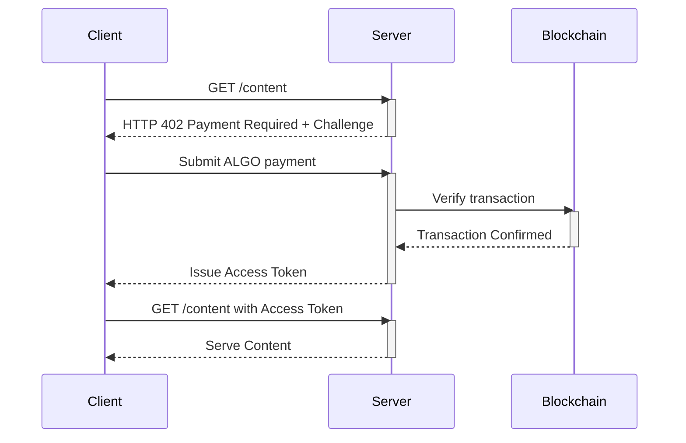

# RFC-HCCP-003: Human Content Compensation Protocol AI Agent Detection System (HCCP-AID)

**HCCP:** 003  
**Title:** Human Content Compensation Protocol AI Agent Detection System (HCCP-AID)
**Status:** Draft  
**Created:** 2025-08-23  

## Abstract

The Human Content Compensation Protocol AI Agent Detection System (HCCP-AID) establishes a framework for identifying agentic AI accessing HCCP-protected content and implementing micropayment requirements through HTTP 402 Payment Required responses. This creates an economic barrier for AI agents whilst maintaining accessibility for human users and legitimate crawlers. The system integrates with HCCP's payment infrastructure to ensure content creators are compensated when their verified human-created content is consumed by AI systems for training or other purposes.


## 1. Introduction

### 1.1 Goals

HCCP-AID aims to:
- Accurately detect agentic AI accessing protected content.
- Ensure legitimate human users and search engines remain unaffected.
- Create a framework for continuously updating detection heuristics as AI agent behaviour evolves.
- Minimise the intrusiveness of detection methods for human users, avoiding overly aggressive challenges that harm user experience.
- Define a standardised logging and reporting format for detection events to facilitate analysis, auditing, and dispute resolution.
- Provide a clear, documented process for organisations to whitelist their legitimate AI agents for paid access, ensuring a smooth path for authorised use.

### 1.2 Requirements Language

The key words "MUST", "MUST NOT", "REQUIRED", "SHALL", "SHALL NOT", "SHOULD", "SHOULD NOT", "RECOMMENDED", "NOT RECOMMENDED", "MAY", and "OPTIONAL" in this document are to be interpreted as described in RFC 2119 and RFC 8174.


## 2. Requirements

* DET_001: When a request to access content is received, the HCCP system shall analyse the request's characteristics to classify it as human or AI.
* DET_002: The HCCP system shall use the request's user-agent string, IP address, and access frequency as part of the source classification.
* DET_003: The HCCP system shall maintain a whitelist of known benign crawlers (e.g., search engine bots) that are exempt from payment challenges.
* DET_004: If a request is classified as an AI system and is not on the whitelist, then the HCCP system shall issue a payment challenge.
* DET_005: If a source's classification cannot be determined with high confidence, then the HCCP system shall present a non-payment challenge (e.g., a HCCPTCHA) to verify the source is human.
* DET_006: If an AI system attempts to bypass a payment challenge, then the HCCP system shall block the request and log the event as a licence violation.


## 3. System Architecture

### 3.1 Deployment and Maintenance Model

The HCCP-AID system is a critical piece of infrastructure that will be developed and actively maintained by the Foundation for the Fair Payment of Media (FYPM). To ensure broad adoption and accommodate different needs, the AID will be provided via two primary models:

1.  **Self-Hosted Reverse Proxy:** For publishers and developers with their own infrastructure, the AID will be available as a standalone reverse proxy service. This service can be deployed on-premises, sitting in front of the content server. It will handle incoming requests, perform the detection analysis, and either serve the content directly or initiate the payment challenge.

2.  **Managed Reverse Proxy Service:** For individual creators or those who prefer a simpler setup, the FYPM will offer a hosted reverse proxy service. Creators can point their domain's DNS records to the FYPM-managed service, which will handle all detection and payment challenges on their behalf before forwarding legitimate human traffic to their origin server.

In both models, the core detection logic—the rulesets, behavioural heuristics, and client fingerprints—will be continuously updated by the FYPM as new AI agents and browsing techniques emerge. These updated rulesets will be distributed to all deployed proxy instances (both self-hosted and managed) to ensure the entire network benefits from the latest detection capabilities.

### 3.2 Non-blockchain Access

The FYPM should also operate APIs for retrieving information from the services to allow other systems to integrate with the HCCP without needing to operate on the Algorand blockchain. These APIs will be used to perform tasks like (but not limited to):
* Retrieve the decentralised identity of an author based on other criteria (e.g. domain, URL, email address)
* Retrieve an author's reputation
* Retrieve the current quality score for a URI

These APIs should not be used to "write back" to the core HCCP, they should only exist to be able to conveniently get information from the HCCP. These APIs may be rate limited (if abused), but should ideally not require access keys or accounts to be able to access.


## 4. Progressive Detection Bootstrap

The AI detection system faces a unique challenge: it must be sophisticated enough to identify evolving AI agents whilst remaining simple enough to deploy quickly and maintain reliably. The solution lies in starting with obvious detection methods and evolving toward subtle behavioural analysis as we learn from real-world deployment. This gradual evolution ensures that human users experience minimal friction whilst the system develops the intelligence needed to handle increasingly sophisticated AI agents.

### 4.1 Phase One

In its initial deployment, the detection system focuses on the signals that require no ambiguity or complex analysis - user-agent strings that explicitly identify them as bots, scripts, or automated tools. They access content at incredible speed, making dozens of requests per second from single IP addresses. They follow predictable patterns, crawling through sites systematically rather than exhibiting the organic browsing behaviour of humans.

The infrastructure for this phase can be as simple as basic rules. Publishers can implement basic detection with minimal technical knowledge, lowering the barrier to adoption. The focus is on establishing the payment flow, training content creators on the system, and beginning to collect data on access patterns that will inform later phases.

### 4.2 Phase Two

This phase introduces the concept of progressive suspicion. Rather than making binary human/bot decisions, the system maintains a running suspicion score that accumulates evidence over time. A single suspicious signal might not trigger any response, but multiple signals within a session begin to paint a picture of automated access. This approach reduces false positives whilst allowing the system to catch more sophisticated automation tools that might pass individual tests but fail when observed holistically.

### 4.3 Phase Three

With behavioural baselines established, the detection system expands to network-level analysis and device fingerprinting. This phase leverages the reality that AI agents often operate from different network environments than typical human users. Data centre IP addresses, cloud hosting providers, and residential proxy networks all have characteristic signatures that can be identified and weighted in the suspicion calculation.

Technical fingerprinting becomes more sophisticated, examining TLS handshake patterns, HTTP header combinations, and browser feature sets that reveal automated tools.

### 4.4 Phase Four

As AI agents become more sophisticated in their evasion techniques, the detection system responds with more nuanced challenge mechanisms. This phase moves beyond simple CAPTCHAs to challenges that test human understanding and interaction in ways that are difficult to automate. 

These challenges should be designed with several key principles: they should be solvable by humans with minimal friction, difficult to automate even with sophisticated AI, and able to provide learning data that improves the system's behavioural models. Successful completion of challenges feeds back into the suspicion scoring system, helping to calibrate the balance between security and user experience.

The economic dimension becomes more prominent in this phase. The cost of solving challenges is designed to exceed the cost of legitimate payment for commercial AI operations. A research institution scraping papers for academic analysis might find it easier to pay a few dollars per month for legitimate access than to engineer solutions for increasingly sophisticated challenges.


## Future Optionality: Adaptive, AI-Driven Detection

The initial detection methods described provide a robust baseline. However, the long-term vision for this protocol is to create a fully adaptive, intelligent detection system. This would involve using machine learning models that are continuously trained on the traffic patterns of the network. Such a system would learn the signature of normal human behaviour and could dynamically identify new and evolving patterns of automated access in real-time. This creates a dynamic 'immune system' for the protocol, where the system uses AI to defend itself against malicious or unauthorised AI, ensuring its effectiveness and resilience far into the future.


## Appendix A: Challenge Response Flow

```

```