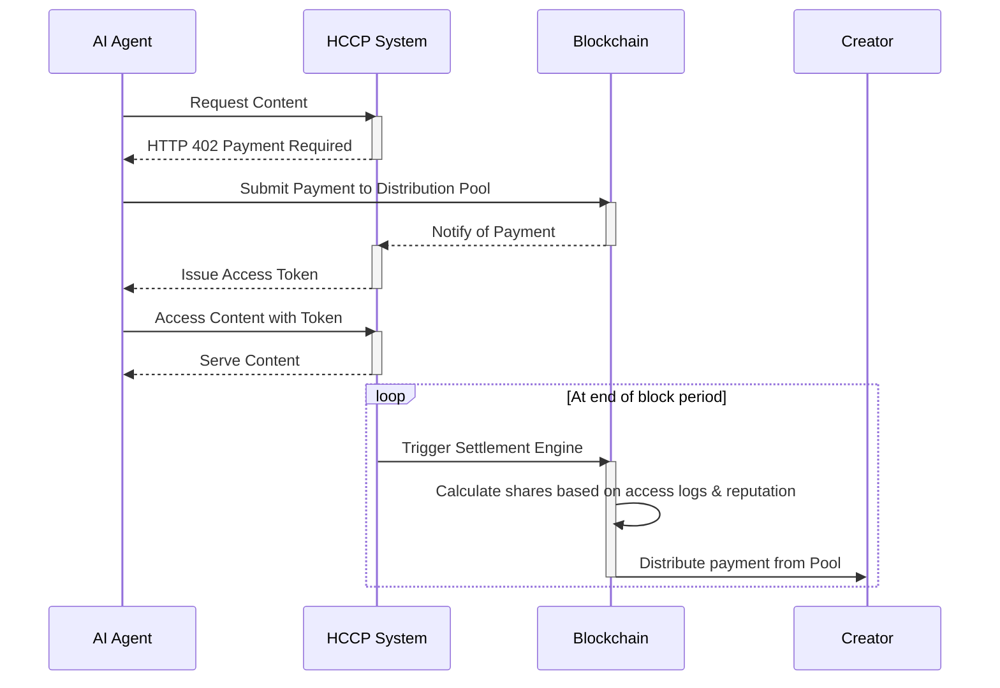

# RFC-HCCP-004: Human Content Compensation Protocol Payment Distribution System (HCCP-PDS)

**HCCP:** 004  
**Title:** Human Content Compensation Protocol Payment Distribution System (HCCP-PDS) 
**Status:** Draft  
**Created:** 2025-08-23  

## Abstract

The Human Content Compensation Protocol Payment Distribution System (HCCP-PDS) establishes a blockchain-based mechanism for distributing payments from AI agents to human content creators. The protocol initially implements a fixed-fee model for content access, with plans to evolve to a fully automated, machine-to-machine auction model in future versions. 

When an AI agent is detected, the system charges a predetermined fee based on content tier classification. The resulting payments are aggregated into distribution pools and fairly distributed to authors. The system uses smart contracts on Algorand to ensure transparent and efficient operation of this data marketplace, creating a sustainable economic model where AI companies compensate human creators for the value their content provides.

## Conceptual Overview

If an idea has value, the internet should make it easier, not harder, to reward its creator. This RFC outlines the protocol—a system designed to answer the simple question: how do we fairly distribute compensation in a world where content is consumed by machines at an unprecedented scale?

The vision is to create an autonomous marketplace for data that evolves over time. Initially, we implement a straightforward fixed-fee system to establish the network and prove the concept. In future iterations, we envision a network of digital pipes that can execute millions of micro-auctions simultaneously. This is a fundamental reimagining of the creator economy. It begins with transparent, predictable pricing and evolves toward a system where value is discovered through programmatic negotiation. Every time a human creation is used to make an AI model more capable, this system ensures that fair compensation is paid, and that the resulting value flows back to the source.

## 1. Introduction

### 1.1 Goals

HCCP-PDS aims to:
- Automatically distribute payments when AI agents access protected content.
- Ensure fair compensation for verified human content creators.
- Implement reputation-weighted distribution that rewards quality.
- Enable real-time micropayments without intermediaries.
- Guarantee the payment system is scalable to efficiently handle a high volume of low-value transactions without incurring prohibitive costs.
- Provide a transparent and publicly auditable trail for all fund movements, from the initial payment to the final creator wallet.
- Define a clear process for handling payment disputes, errors, and refunds in a decentralized manner.
- Allow creators to define flexible payment distribution rules, such as splitting revenue between multiple authors or automatically allocating a portion of earnings to different wallets.

### 1.2 Requirements Language

The key words "MUST", "MUST NOT", "REQUIRED", "SHALL", "SHALL NOT", "SHOULD", "SHOULD NOT", "RECOMMENDED", "NOT RECOMMENDED", "MAY", and "OPTIONAL" in this document are to be interpreted as described in RFC 2119 and RFC 8174.

## 2. Requirements

 Payment Collection and Access
* PAY_001: When a detected AI agent requests content, the HCCP system shall apply the appropriate fixed fee based on content tier classification.
* PAY_001a: [Future Version] The system shall support automated, machine-to-machine price negotiation protocols.
* PAY_002: The initial fixed fees shall be determined by content tier: Standard ($0.001), Premium ($0.005), or Specialized ($0.01).
* PAY_002a: [Future Version] Dynamic pricing shall be based on AI agent bids and floor prices determined by content quality rank and author reputation.
* PAY_003: The payment process MUST conclude in real-time without human intervention.
* PAY_004: When a price is agreed upon and the corresponding payment is received, the HCCP system shall issue a cryptographic Access Token that grants the AI agent temporary access to the content.
* PAY_005: The HCCP system shall aggregate all payments collected during a defined block period into a single Distribution Pool.

Block-Based Distribution
* PAY_006: At the end of each block period, the Settlement Engine contract shall initiate the fund distribution process from the Distribution Pool.
* PAY_007: The HCCP system shall first allocate 7% of the total Distribution Pool to the HCCP treasury and 3% to network validators.
* PAY_008: For each piece of content accessed during the block period, the HCCP system shall calculate a "Share Weight" by multiplying the total number of access events by a multiplier derived from the author's reputation score.
* PAY_009: The HCCP system shall distribute the remaining 90% of the Distribution Pool to authors in direct proportion to their content's total Share Weight for that period.
* PAY_010: Where content has multiple registered authors, the HCCP system shall divide that content's allocated share according to the contribution rules defined in its identity attestation.

## Future Optionality: Dynamic Pricing and Machine-to-Machine Negotiation

While the initial implementation uses fixed-fee pricing for simplicity and rapid deployment, the protocol is designed to evolve toward dynamic, automated pricing mechanisms. Future versions will implement:

- **Real-time Auction System**: AI agents will bid for content access based on their assessment of utility value
- **Reputation-Based Floor Pricing**: Minimum prices determined by author reputation and content quality scores
- **Demand-Responsive Pricing**: Prices that adjust based on access patterns and market demand
- **Bulk Access Negotiations**: Automated protocols for high-volume consumers to negotiate favorable rates

This transition will occur gradually as the network matures and market dynamics become clearer through initial fixed-fee operations.

## Future Optionality: Full Decentralized Governance (DAO)

The protocol is designed to be stewarded by the FYPM foundation initially, but its ultimate state is one of full decentralization. A major future step is the transition to a Decentralized Autonomous Organization (DAO) where all key economic parameters are controlled by the community of HCCP token holders. This would include the ability to vote on the treasury fee, validator rewards, the fixed fee tiers (and eventually dynamic pricing formulas), and the ratification of bulk-access agreements. This transition to a DAO would fulfill the protocol's promise of becoming a true public utility, owned and operated by the creators and users it serves, ensuring that its evolution is always aligned with the interests of its community.

## Appendix A: Payment Flow Diagram

